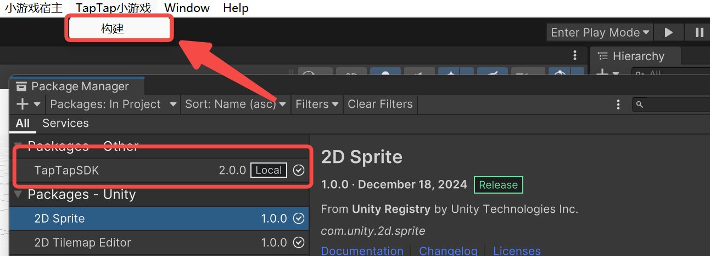
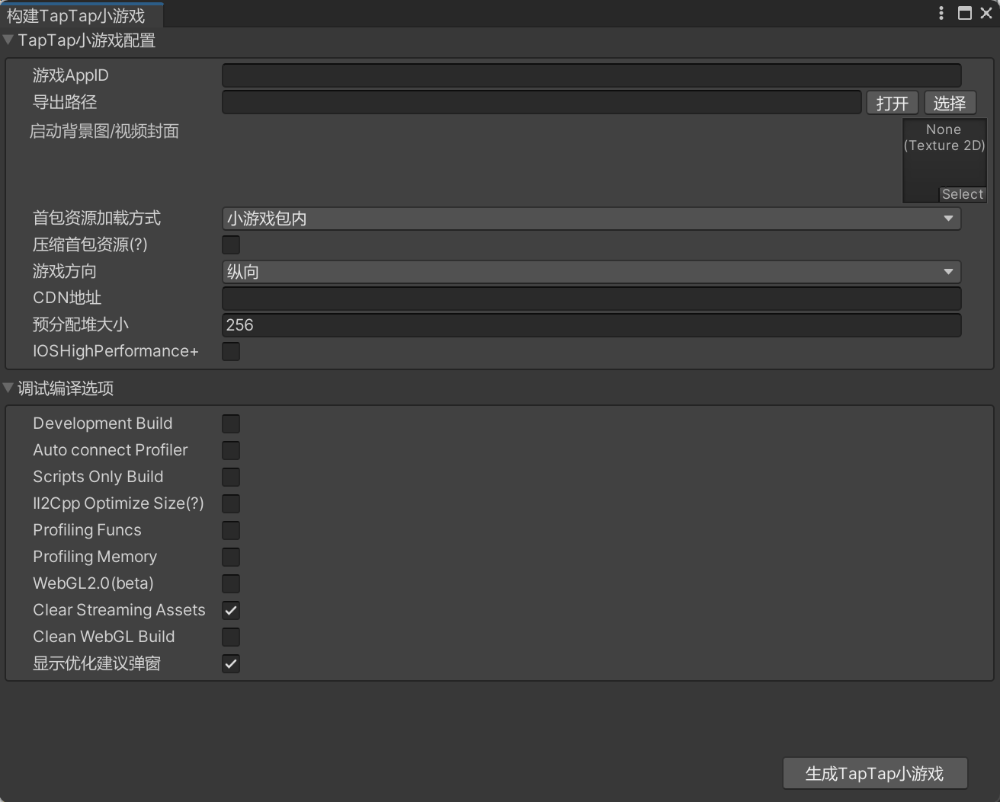
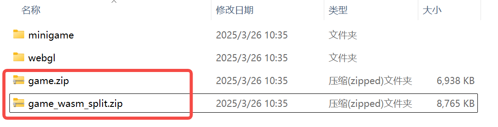

# TapTap SDK

## 1. 概述

`com.taptap.minigame` 新增了 TapTap 自定义接口，可以构建并生成 TapTap 小游戏。

注意：本包无法与wx sdk、minihost sdk插件兼容，需要在Package Manager中手动卸载wx sdk和minihost sdk。

## 2. 如何导入该包

- 打开 Tuanjie，导航到 `Window` > `Package Manager`。
- 点击左上角的 `+` 图标，选择 `Add package from disk...`。
- 选择本包内的`package.json`导入。
- 导入成功后菜单栏中出现 “TapTap 小游戏”。

## 3. 使用方法

1. 点击菜单栏中的 “TapTap 小游戏 > 构建” ，弹出构建工具面板

   

2. 在面板中填写必要信息和配置，设置导出路径，完成后点击“生成 TapTap 小游戏”

   

3. 等待构建完成后，打开导出路径文件夹，其中 game.zip 和 game_wasm_split.zip 是 TapTap 小游戏压缩包，可上传至 TapTap 平台。

   

## 4. Tap C#自定义接口

### 1. setShareboardHidden

#### javascript 定义

tap.setShareboardHidden(Object object)

Object 定义
| 字段 | 类型 | 必要 | 说明 |
|-------|-------|-------|-------|
| hidden | boolean | 是 | 是否隐藏 |
| success | function | 否 | 成功回调 |
| fail | function | 否 | 失败回调 |
| complete | function | 否 | 完成回调 |

```javascript
// 隐藏分享面板
tap.setShareboardHidden({
  hidden: true,
  success: function () {},
  fail: function () {},
  complete: function () {},
});
```

#### C#调用

```c#
using minihost;
using TapTapMiniGame;


Tap.SetShareboardHidden(new SetShareboardHiddenOption
{
    hidden = true,
    success = () =>
    {
        Debug.Log("[SetShareboardHidden] success");
    },
    fail = () =>
    {
        Debug.Log("[SetShareboardHidden] fail");
    },
    complete = () =>
    {
        Debug.Log("[SetShareboardHidden] complete");
    }
});
```

### 2. showShareboard

#### javascript 定义

tap.showShareboard(Object object)

Object 定义
| 字段 | 类型 | 必要 | 说明 |
|-------|-------|-------|-------|
| title | string | 否 | 分享标题 |
| desc | string | 否 | 分享文案 |
| success | function | 否 | 成功回调 |
| fail | function | 否 | 失败回调 |
| complete | function | 否 | 完成回调 |

`success` 和 `fail` 的回调参数 res

| 字段   | 类型   | 说明     |
| ------ | ------ | -------- |
| errNo  | string | 错误码   |
| errMsg | string | 错误信息 |

```javascript
// 展示分享面板
tap.showShareboard(
  title: "分享标题",
  desc: "分享文案",
  success: function (res) {
    console.log(res.errMsg);
  },
  fail: function (res) {
    console.log(res.errNo, res.errMsg);
  },
  complete: function () {
  }
);
```

#### C#调用

```CS
using minihost;
using TapTapMiniGame;

Tap.ShowShareboard(new ShowShareboardOption
{
    title = "分享标题",
    desc = "分享文案",
    success = (res) =>
    {
        Debug.Log("[ShowShareboard] success:"+ res.errMsg);
    },
    fail = (res) =>
    {
        Debug.Log("[ShowShareboard] fail:" + res.errMsg);
    },
    complete = () =>
    {
        Debug.Log("[ShowShareboard] complete");
    }
});
```

### 3. onShareMessage 与 offShareMessage

#### javascript 定义

tap.onShareMessage(function listener)

`listener` 的 **参数** 定义
| 字段 | 类型 | 必要 | 说明 |
|-------|-------|-------|-------|
| channel | string | 是 | 分享渠道 |

`listener` 的 **返回值** 定义
| 字段 | 类型 | 必要 | 说明 |
|-------|-------|-------|-------|
| channel | string | 否 | 分享渠道 |
| title | string | 否 | 分享标题 |
| desc | string | 否 | 分享文案 |
| query | string | 否 | 透传字段，可在唤起时通过 onShow 函数获取 |
| success | function | 否 | 成功回调 |
| fail | function | 否 | 失败回调 |
| complete | function | 否 | 完成回调 |

`success` 和 `fail` 的回调参数 res
| 字段 | 类型 | 说明 |
|-------|-------|-------|
| errNo | string | 错误码 |
| errMsg | string | 错误信息 |

```javascript
// 当监听到用户点击了某个分享渠道
tap.onShareAppMessage(function (res) {
  console.log(res.channel);
  // 自定义分享内容
  return {
    //执行函数后，这里是需要该函数返回的对象
    title: "分享标题",
    desc: "分享内容",
    query: "k1=v1&k2=v2",
    success(res) {
      console.log("分享成功");
    },
    fail(res) {
      console.log("分享失败", res.errMsg);
    },
  };
});
```

tap.offShareMessage()

#### C#调用

```cs

using minihost;
using TapTapMiniGame;

# 定义 listener
private readonly Action<OnShareMessageListenerResult, Action<ShareMessageParam>> _onShareMessage = (
    res,
    callback
) =>
{
    callback(
        new ShareMessageParam
        {
            channel = !string.IsNullOrEmpty(res.channel) ? res.channel : "分享渠道",
            title = "分享标题",
            desc = "分享文案",
            query = "key1=val1&key2=val2",
            success = (res) =>
            {
                Debug.Log("[onShareMessage] success");
            },
            fail = (res) =>
            {
                Debug.Log("[onShareMessage] fail");
            },
            complete = () =>
            {
                Debug.Log("[onShareMessage] complete");
            }
        }
    );
};

# 监听与移除监听函数
Tap.OnShareMessage(_onShareMessage);
Tap.OffShareMessage(_onShareMessage);
```

## 5. FAQ

**1. `error CS0433: The type 'xxx' exists in both
minihost-plugin.wxadaptor.editor, Version=1.0.0.0.0, Cultture=neutral, PublicKeyToken=null' and 'wx-runtime-edittor, Version=0.0.0.0, Culture=neutral, PublicKeyToken=ull`**

当前tap sdk无法与wx sdk、minihost sdk插件兼容，需要在Package Manager中手动卸载wx sdk和minihost sdk

**2. Linear color space 需使用Webgl2，终止导出。请在 Player Settings 的 Graphics APIs 中手动选择 WebGL 2.**

WebGL 平台下，只有 WebGL 2.0 才支持 Linear Color Space。

如果你选了 Linear，但启用了 WebGL 1.0（默认可能会勾选），就会报这个错误。

请在 Player Settings (WebGL) -> Other Settings -> Graphics APIs 列表中只保留 WebGL 2.0 ，或者更改 Color Space 为Gamma